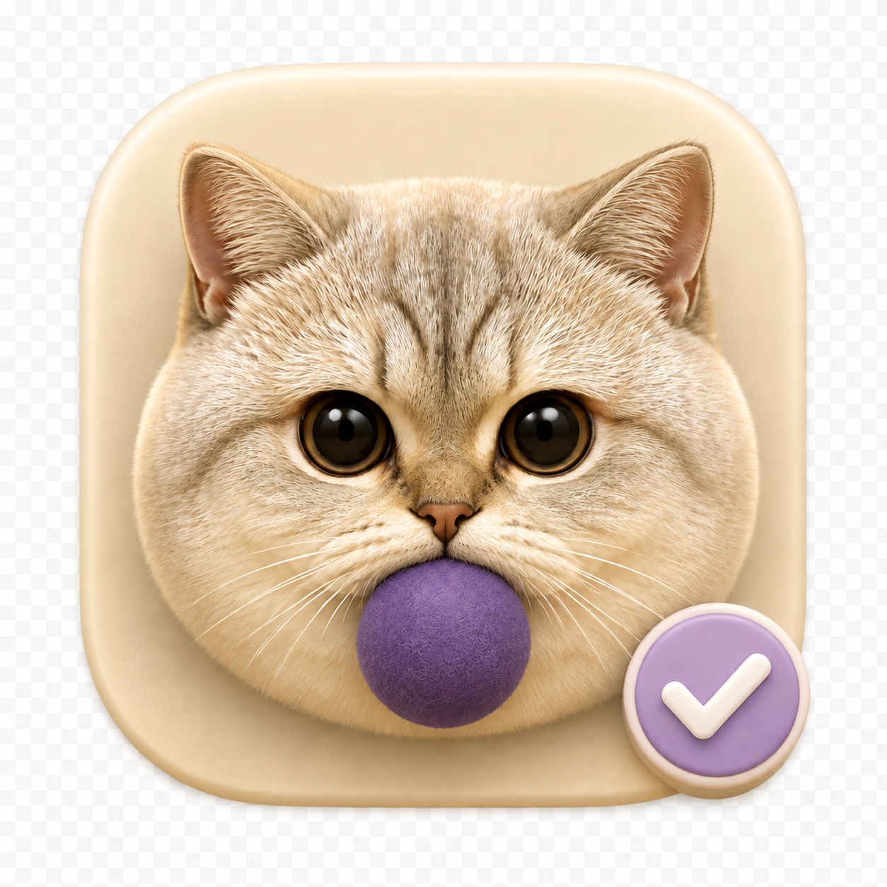

# 五子 Todo

### 让五子陪你记住小事

一款住在 Mac 菜单栏里的猫咪待办 App。
记录、提醒、勾选完成，还有五子的各种可爱状态。

**[点击这里直接下载安装包 ↓](https://github.com/tenglin01/wuzi-todo-download/releases/latest/download/Wuzi-Todo.dmg)**

macOS 14 或更新版本 · Apple Silicon 与 Intel · 约 8 MB

[安装方法](#安装方法) · [怎么使用](#怎么使用) · [版本与反馈](#版本与反馈)

---

## 安装方法

1. 点击上方下载按钮，下载 `Wuzi-Todo.dmg`。
2. 打开安装包，把「五子 Todo」拖到右侧「应用程序」。
3. 从「应用程序」打开五子 Todo，通过菜单栏猫头图标展开待办面板。

**首次打开提示无法验证开发者？**

当前是个人开发的试用版本，尚未进行 Apple Developer ID 签名与公证。请确认安装包来自本页面；如果 macOS 阻止打开，可查看「系统设置 → 隐私与安全性」中的相关提示。无需关闭系统安全保护。

## 怎么使用

| 想做什么 | 操作 |
| --- | --- |
| 记录一件事 | 点击「添加待办」；App 内空闲时也可尝试 Enter |
| 快速设置时间 | 输入「明天下午三点取快递」或「30分钟后喝水」，检查显示的时间后保存 |
| 修改待办 | 点击待办文字，直接原位置编辑 |
| 完成 / 删除 | 勾选左侧方框；右侧「⋯」菜单可删除 |
| 取消输入 | 点击「取消」或按 Esc |
| 从其他 App 快速添加 | 默认 ⌃⌥Space；可在「设置 → 提醒与日历」录制自己的快捷键 |
| 换一张五子照片 | 打开「设置 → 照片与外观」，选择状态、更换照片或开启随机状态 |

## 小小的陪伴

- **随手记**：待办记录与编辑，不需要注册账号。
- **有时间感**：常用中文时间识别、系统通知和日历连接。
- **五子的日常**：多种猫咪状态，自定义照片并自动去除背景。
- **适合你的习惯**：自定义全局快捷键、纽约或设备位置天气。

## 试用前了解

- 目前仅提供 **Mac 版**，没有 iPhone 或 Windows 安装包。
- 系统通知显示仍需实机验证，暂不建议用于不能错过的重要提醒。部分键盘交互的实机验证尚未完成。
- 当前版本会在跨日后清理已完成的待办，请勿把已完成列表当作长期档案。
- 待办与设置保存在本机。天气功能需要联网；设备位置天气会向天气服务发送坐标，可在设置中关闭。

## 版本与反馈

- [查看全部版本和更新说明](https://github.com/tenglin01/wuzi-todo-download/releases)
- [反馈问题或建议](https://github.com/tenglin01/wuzi-todo-download/issues)

这个仓库是公开下载与反馈页面；应用源码单独维护。

## 贡献者

**[Teng · @tenglin01](https://github.com/tenglin01)** 和 **Jane Xu**
